# Office Clause Library #

This repository shows how you can build a library of clauses that can be added to a word document. 
These clauses can then be reused within documents. The clauses can be stored to any SharePoint library 
that contains the app.  

The solution demonstrates authenticating of users via the Azure AD.
It utilizes the Office 365 Discovery Client to identify a users' SharePoint Online resource, and uses REST 
calls to communicate to SharePoint.  The Office Add-In is then constructed with an Angular 
application demonstrating some of the capabilities of the Office JS libraries.

**Note: If possible, please use this sample with a "non-work" or test account in Office 365. With the 
current version of the project, it does not clean up the created lists within any connected SharePoint 
Online subsite. At this time you'll have to manually remove these artifacts, for example, the clauses, groups, 
and tags lists.**

# How to Run This Sample #
To run this sample, you need:
1. Visual Studio 2015, with Office Developer Tools installed.
	* If Office Developer Tools are not installed, the **ClauseLibrary.OfficeApp** may be unable to load.
	* If this happens, simply right-click on the project and select 'Reload Project'. Follow the instructions to install the Office Developer Tools.
	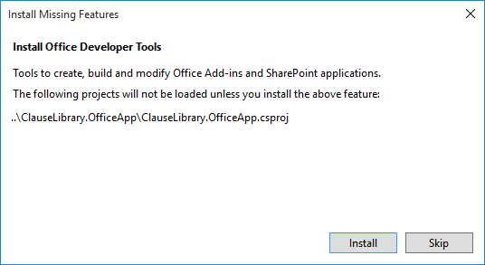

2. Office Word 2013 or higher

3.  A Microsoft Azure subscription with a Microsoft Azure Active Directory (AD) tenant to register your application. Azure AD provides identity 
services that applications use for authentication and authorization. A trial subscription can be acquired 
here: [Microsoft Azure](https://account.windowsazure.com/SignUp).

4. Office 365 Developer account.  You can sign up for an Office 365 Developer subscription that includes 
the resources that you need to start building Office 365 apps.  Create a new subsite under your SharePoint
Online subscription.  You will also need to ensure that you are under the First Release update path.  To check this on your 
Office 365 subscription, navigate to https://portal.office.com as an administrator.  Under the Admin view, navigate to Service Settings -> Updates.
Ensure that you are on First release.  This may take up to 24 hours to be activated.
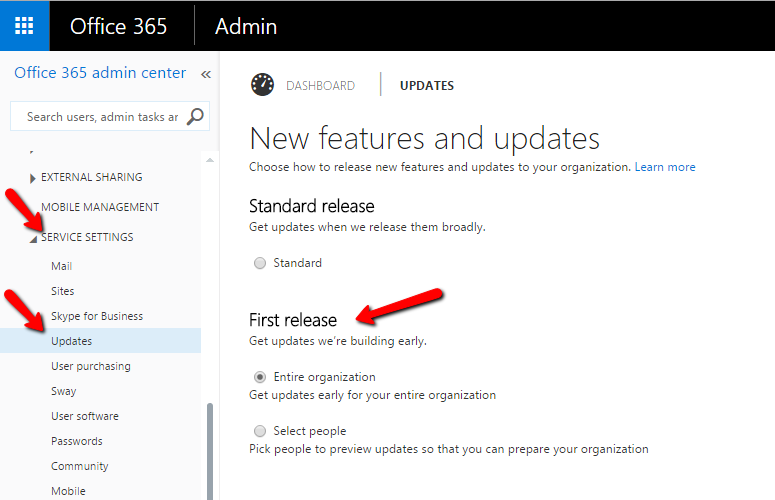

## Before You get the Code ##

### 1. Create a SharePoint Subsite ###
1. Log on to your SharePoint online site.
2. Click on the settings cog in the navigation header. Navigate to Site Contents.
 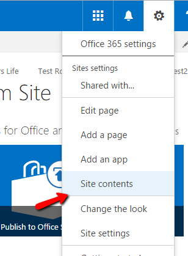

3. Scroll down until the Subsites section is visible.  Click on the "new subsite" link.
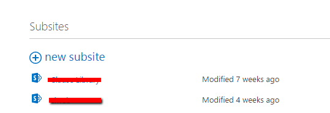

4. Enter a title and description for the subsite.  Enter a new URL for the subsite.  Remember this address.
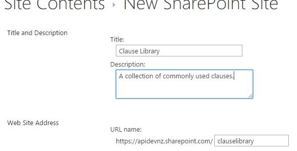

5. Leave the template as the default (Collaboration/Team Site).  Scroll to the bottom and click Create to finalize the subsite.

## Running the Solution ##
### Step 1: Clone or download this repository ###
From your Git Shell or Command line: 

`git clone https://github.com/OfficeDev/Word-Add-in-ClauseLibrary-Code-Sample`

## Step 2: Build and Deploy the Project ##
1. Open the project in Visual Studio 2015.
2. Check that all projects have loaded.  If the **ClauseLibrary.OfficeApp** project is unavailable, please refer to the section above.
3. Right-click on the **ClauseLibrary.Web** project and then click on Properties.
4. Under the Web section, copy the URL from the Project Url field.
 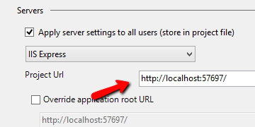

### 3. Create an Azure AD Application ###
1. Connect to the Azure Management Portal and navigate to the Azure AD tenant.
2. Navigate to the Applications Section, and then click on the Add button on the command bar.
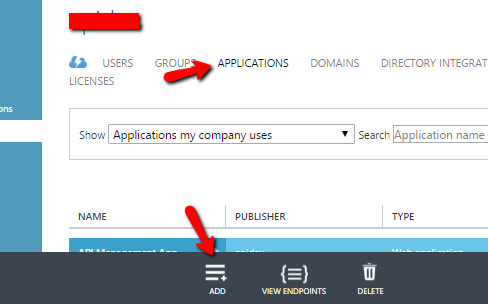
3. When prompted by the wizard, select "Add an application my organization is developing".
On the next screen, type in a name for the Azure AD Application. 
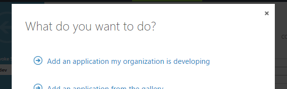
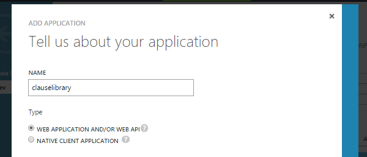

4. Give the application a valid URL for the Sign-on URL property, 
and a unique App ID URI (e.g. http://clauselibrary).  These URLs do not need to exist.
Create the application.
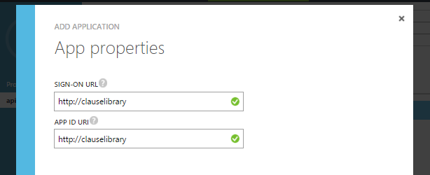

5. Your Azure AD Application should now be created. 
Navigate to Configure.
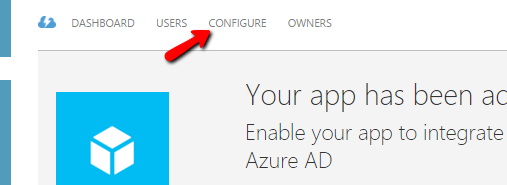

6. Under the Reply URL settings, add the URL of the authentication callback path.  
This should be the Project URL (copied earlier), with the route */authentication/processcode*
i.e. 
`http://localhost:57697/Authentication/ProcessCode`
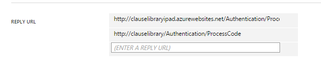

7. This AD application must also be granted specific permissions for SharePoint Online:
	* Windows Azure Active Directory
		* *Sign in and read user profile* delegated permission.
	* Office 365 SharePoint Online
		* *Read and write items and lists in all site collections* delegated permission.
		* *Have full control of all site collections* application permission.
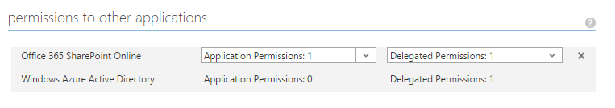

8. Take note of the Client ID value for the application.  
9. Create a new key secret.  This will be provided after the application configuration has been saved.
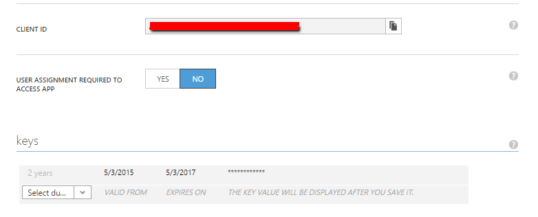
10. Save the application.  You should now be able to retrieve the generated key.  
Take note of this key secret.

## Step 4: Build and Run the Office Application ##
1. Open the project in Visual Studio 2015.
2. Build the project to restore NuGet packages.
3. Locate the **web.config** file under the **ClauseLibrary.Web** project.
4. Replace the *{ida:ClientId}* app setting with the client ID of your registered Azure application.
5. Replace the *{ida:ClientKey}* app setting with the key secret of your registered Azure application.
6. Hit F5 to run the solution.  The Clause Library app should now appear in Word, pointing to the Clause Library app running in IIS Express.

## Step 5: Using the Clause Library ##
1. Click the *Log in to Clause Library* link and enter your Azure AD credentials in the corresponding dialog.
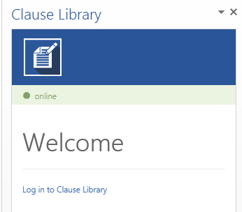
 If a login error occurs, try some of the following:
	* Double checking that the Azure AD settings (clientid and secret) have been correctly entered.
	* Changing the token storage to not use cookies.  Open the **web.config**, and set the *UseCookieForTokenStorage* app setting to false.
	* Ensure Discovery Service is available.  Follow the instructions at the top of this guide to update Office 365 to First release.

2. You will be prompted to create a library.  In the SharePoint URL field, enter the full URL
of the SharePoint Online subsite that you have created earlier.  E.g. `https://{your-sharepoint-tenant}.sharepoint.com/clauselibrary`
3. Enter a name and description for your new clause library, and finish by clicking Create.
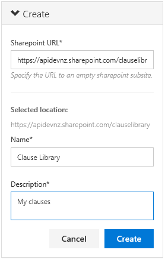

4. The Clause Library application will create the necessary lists at the specified SharePoint subsite, 
and will connect the application.  Clauses can now be remembered and recalled.

## Extra for Experts ##
The above instructions leverage IIS Express.  To turn things up a notch, why not try [running this in Azure.](AZURE.md)

## Copyright ##
Copyright (c) 2015 Microsoft. All rights reserved.